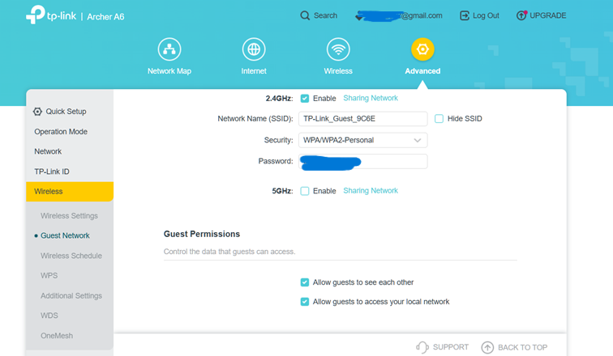
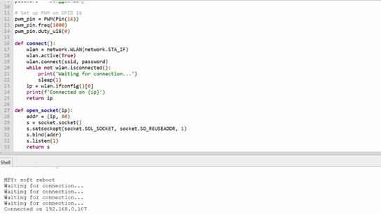
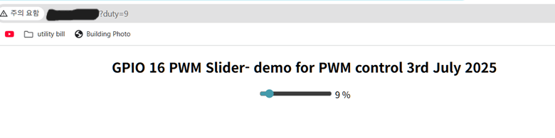
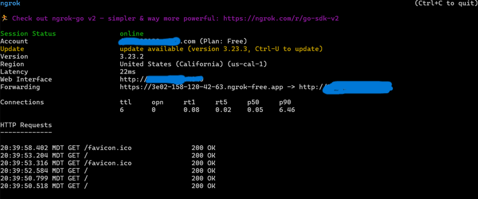

<h1 align="center">Raspberry Pi Pico 2W - Wireless Motor Control</h1>

Project Team:
<ul style="list-style-position: inside;">
  <li>Donggeon Kim</li>
</ul>

---

## Project Summary

This project demonstrates wireless control of a motor (LED for now) using a Raspberry Pi Pico 2W, MicroPython, and `ngrok` for remote access. A web-based interface with a PWM slider adjusts motor speed in real time over Wi-Fi. The backend is hosted on the Pico 2W and made publicly accessible using `ngrok`, eliminating the need for manual router configuration.

**How It Works:**
- A MicroPython script serves an HTML page with a PWM slider.
- User input (0–100) sets the PWM duty cycle for motor control.
- Communication is handled over Wi-Fi; `ngrok` exposes the server via a public HTTPS link.
- A MOSFET acts as a switch to drive the motor with appropriate voltage based on PWM input.

---

  

Figure 1. Wi-Fi Router Configuration for 2.4GHz and checking option for allowing device-to-device communication

## System Architecture

1. **Power**  
   - USB supplies power to the Pico 2W  
   - External source powers motor through MOSFET //later

2. **Control**  
   - PWM output from GPIO (e.g., GP16)  
   - MOSFET controls motor rpm (For now, just LED is used to indicate it is sending PWM)
   - Web server on Pi Pico 2W  
   - Public access via `ngrok`

3. **Interface**  
   - HTML slider updates PWM duty via GET requests  
   - URL format: `https://<random-id>.ngrok-free.app/?duty=75`  
   - Slider input controls motor in near real-time

---

## Development Milestones

### Milestone 1  
- Set up Pico 2W with MicroPython
-  Download Thonny IDE from https://github.com/thonny/thonny/releases/tag/v4.1.7
-  Download MicroPython UF2 file for pico 2w board
  --  https://www.raspberrypi.com/documentation/microcontrollers/micropython.html#drag-and-drop-micropython 
- Verified PWM output to motor  

  

Figure 2. Thonny IDE with MicroPython script loaded for Pico 2W

### Milestone 2  
- HTML interface created using `<input type="range">`  
- Integrated with MicroPython server  

### Milestone 3  
- `ngrok` tunnel configured to allow external access  
- Tested mobile and cross-device compatibility  

---

## Hardware Details

- **LED Control Pin**: GP16  

---

### Component List

- 1x Raspberry Pi Pico 2 W    
- 1x LED 
- 1x USB Cable - Micro

---

## Software Details

- **Language & SDK**: MicroPython using Thonny IDE  
- **Web Interface**: HTML slider served from the Pico 2W
  

  

Figure 3. Web interface with slider to control motor/LED

- **Back-end Logic**: Parses `?duty=value` from HTTP GET request  
- **PWM Setup**: 1 kHz frequency, 0–100% duty cycle  
- **ngrok**: Tunnels HTTP port (default 80) to a random public URL  
  - Example: `https://abcd-1234-5678.ngrok-free.app/?duty=60`  

  

Figure 4. ngrok tunnel running and exposing Pico 2W web server

---

## Notes

- The `ngrok` URL changes every session unless upgraded to Pro.
- Avoid sharing real IP addresses in public README for security.
- Free tier allows 4-hour sessions before requiring a restart.

---

